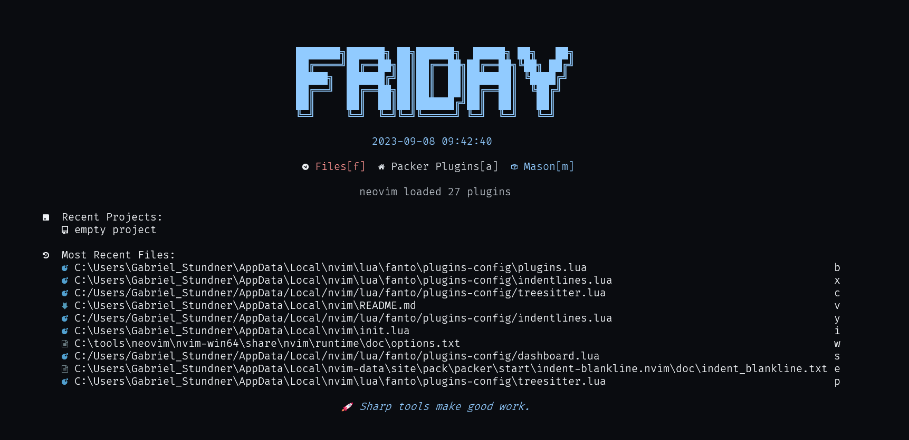
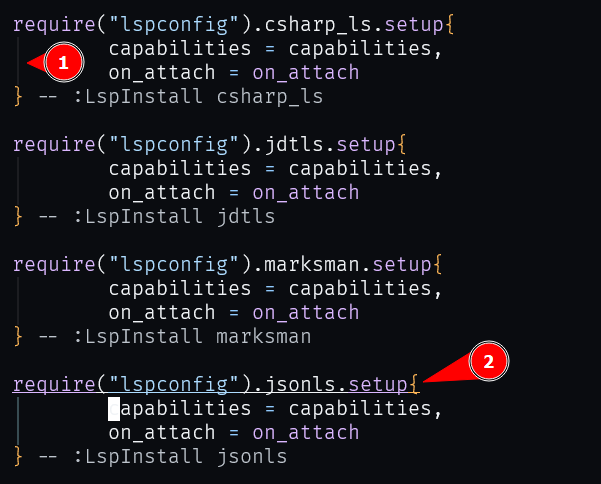
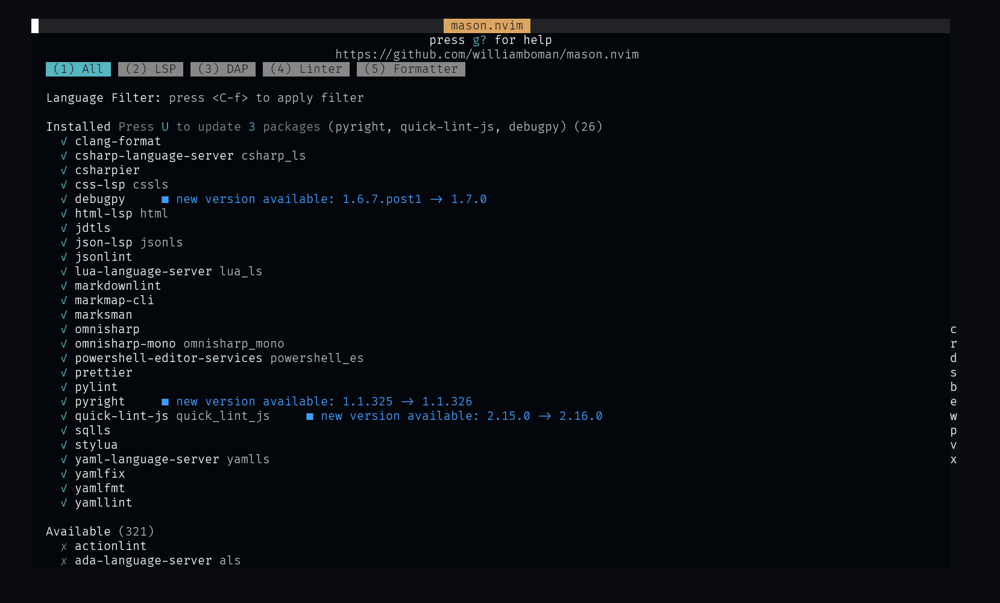
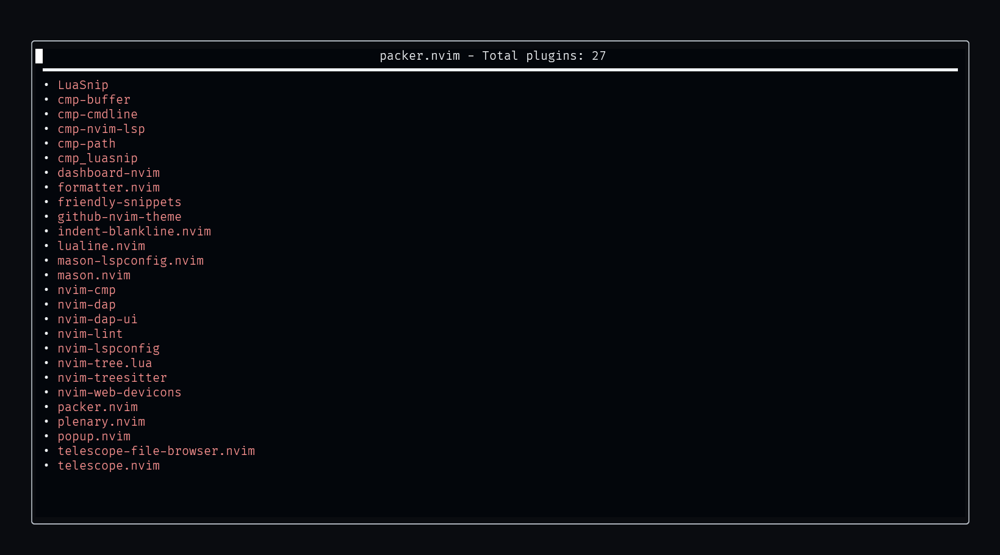
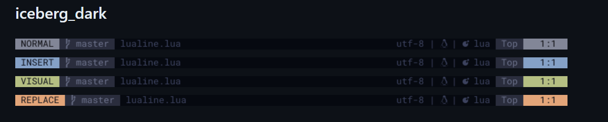
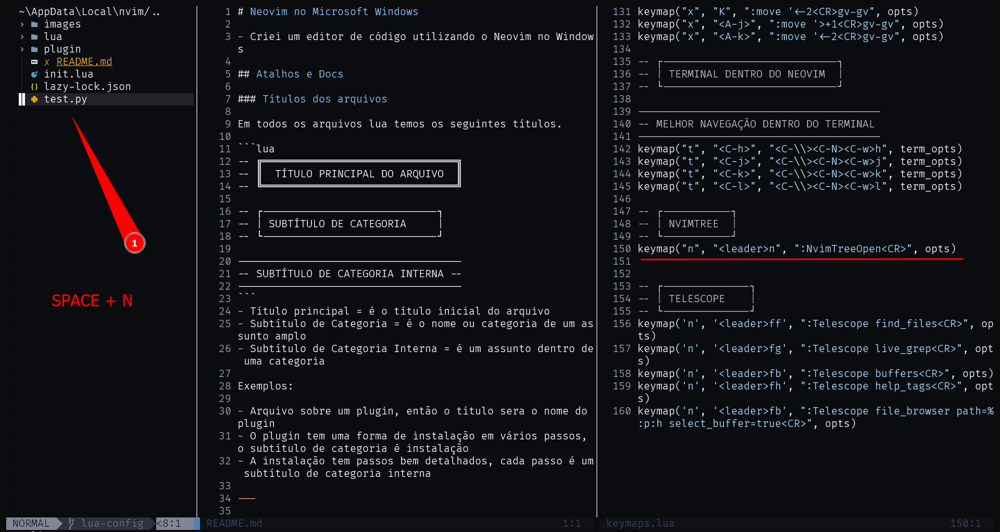

# Neovim no Microsoft Windows

- Criei um editor de código utilizando o Neovim no Windows

## Atalhos e Docs

### Títulos dos arquivos

Em todos os arquivos lua temos os seguintes títulos.

```lua
-- ╔═══════════════════════════════╗
-- ║  TÍTULO PRINCIPAL DO ARQUIVO  ║
-- ╚═══════════════════════════════╝

-- ┌----------------------------┐
-- | SUBTÍTULO DE CATEGORIA     |
-- └----------------------------┘

------------------------------------
-- SUBTÍTULO DE CATEGORIA INTERNA --
------------------------------------
```
- Título principal = é o título inicial do arquivo
- Subtítulo de Categoria = é o nome ou categoria de um assunto amplo
- Subtítulo de Categoria Interna = é um assunto dentro de uma categoria

Exemplos:

- Arquivo sobre um plugin, então o título sera o nome do plugin
- O plugin tem uma forma de instalação em vários passos, o subtítulo de categoria é instalação
- A instalação tem passos bem detalhados, cada passo é um subtítulo de categoria interna

---


## Instalação

### 1 - Instalar o Chocolatey

Podemos baixar o Chocolatey com o seguinte script de powershell:

```powershell
# Set directory for installation - Chocolatey does not lock
# down the directory if not the default
$InstallDir='C:\ProgramData\chocoportable'
$env:ChocolateyInstall="$InstallDir"

# If your PowerShell Execution policy is restrictive, you may
# not be able to get around that. Try setting your session to
# Bypass.
Set-ExecutionPolicy Bypass -Scope Process -Force;

# All install options - offline, proxy, etc at
# https://chocolatey.org/install
iex ((New-Object System.Net.WebClient).DownloadString('https://community.chocolatey.org/install.ps1'))
```

Coloque o seguinte script em um arquivo chamado `ChocolateyInstallNonAdmin.ps1`


---


### 2 - Instalar o Neovim

Podemos instalar NEOVIM com o seguinte comando:

```powershell
choco install neovim
```

---

### 3 - Plugins instalados

#### dashboard-nvim

- Localização do arquivo: `lua/fanto/plugins-config/dashboard.lua`
- Repositório oficial: [https://github.com/nvimdev/dashboard-nvim](https://github.com/nvimdev/dashboard-nvim)

É um plugin para o Neovim (ou Vim) que cria uma página inicial personalizável e informativa quando você inicia o Neovim. 

Ele oferece uma visão geral rápida de informações úteis, como listas de arquivos recentes, projetos favoritos, comandos personalizados e muito mais. 

O dashboard-nvim é projetado para melhorar a produtividade do usuário, permitindo que você acesse facilmente seus projetos e arquivos frequentemente usados, além de fornecer uma experiência de inicialização mais agradável.

Para abrir o plugin, só escrever no terminal `nvim`

<p align="center">
    
</p>


---

#### indent-blankline

- Localização do arquivo: `lua/fanto/plugins-config/indentlines.lua`
- Repositório oficial: [https://github.com/lukas-reineke/indent-blankline.nvim](https://github.com/lukas-reineke/indent-blankline.nvim)

É um arquivo simples que indenta as chaves de uma função e mostra uma linha conectando o inicio e o fim de uma função

<p align="center">
    
</p>

---

#### Mason

- Localização do arquivo: `lua/fanto/plugins-config/mason.lua`
- Repositório oficial: [https://github.com/williamboman/mason.nvim](https://github.com/williamboman/mason.nvim)
- Dependências:
    - Mason-lspconfig: [https://github.com/williamboman/mason-lspconfig.nvim](https://github.com/williamboman/mason-lspconfig.nvim)
    - nvim-dap: [https://github.com/williamboman/mason-lspconfig.nvim](https://github.com/williamboman/mason-lspconfig.nvim)
    - nvim-lint: [https://github.com/mfussenegger/nvim-lint](https://github.com/mfussenegger/nvim-lint)
    - formatter: [https://github.com/mhartington/formatter.nvim](https://github.com/mhartington/formatter.nvim)
    - nvim-lspconfig: [https://github.com/neovim/nvim-lspconfig](https://github.com/neovim/nvim-lspconfig)
    - cmp-nvim-lsp: [https://github.com/hrsh7th/cmp-nvim-lsp](https://github.com/hrsh7th/cmp-nvim-lsp)
Mason é um package manager para auxiliar a instalação de autocompletes para as linguagens de programação, assim como colorir o código e tudo que ele precise


<p align="center">
    
</p>

---

#### Packer

- Localização do arquivo: `lua/fanto/plugins-config/plugins.lua`
- Repositório oficial: [https://github.com/wbthomason/packer.nvim](https://github.com/wbthomason/packer.nvim)

Packer serve para instalar plugins no Neovim

<p align="center">
    
</p>


----

#### Lualine

- Localização do arquivo: `lua/fanto/plugins-config/lualine.lua`
- Repositório oficial: [https://github.com/nvim-lualine/lualine.nvim](https://github.com/nvim-lualine/lualine.nvim)

Lualine é uma melhoria de infos mostrados abaixo do Neovim.

Eu uso o tema `iceberg-dark`

<p align="center">
    
</p>

----

#### Nvim-tree

- Localização do arquivo: `lua/fanto/plugins-config/nvimtree.lua`
- Repositório oficial: [https://github.com/nvim-tree/nvim-tree.lua](https://github.com/nvim-tree/nvim-tree.lua)

Nvim-tree é um plugin para mostrar os diretórios e arquivos do lado direito do neovim

<p align="center">
    
</p>


